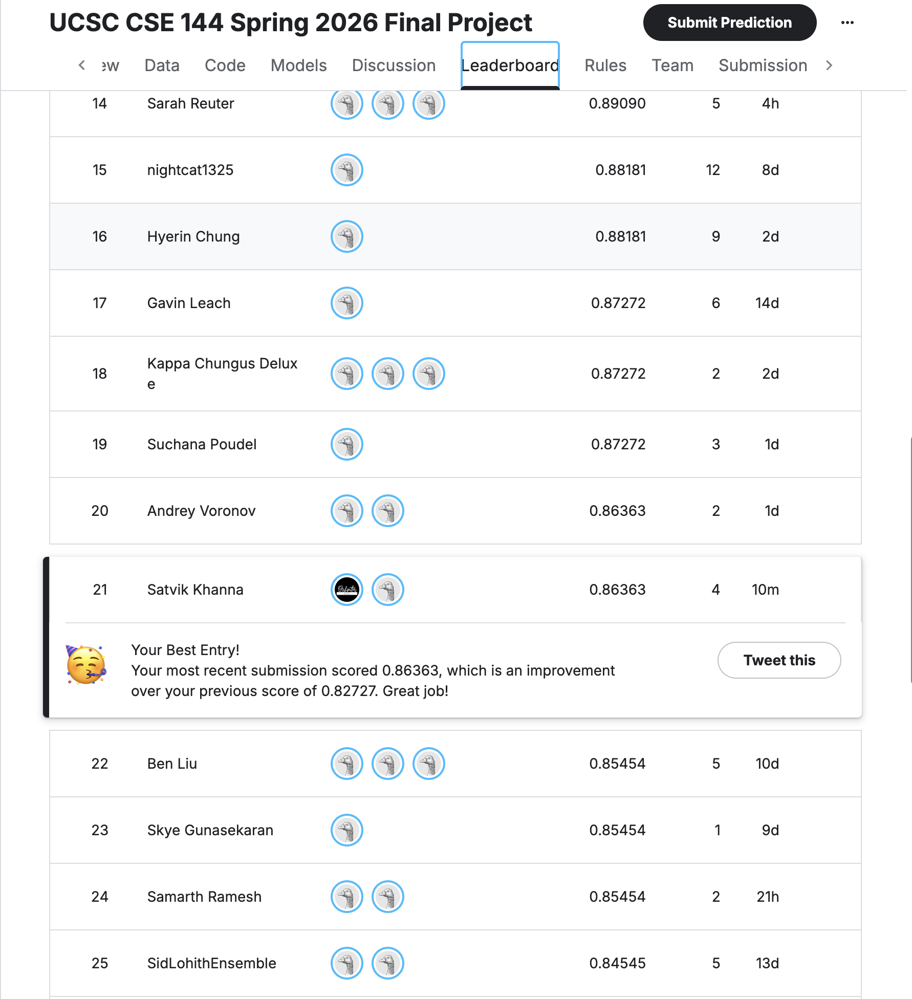

# CSE 144 Final Project

[Report & Weights (Google Drive)](https://drive.google.com/drive/folders/1BjIqZdYgbDBN4LeKBsoVe0rSGbXeAZcB?usp=sharing)

## Kaggle Leaderboard



## Setup

```bash
pip install -r requirements.txt
```

Download the Kaggle competition data and place it so the directory structure looks like:

```
ucsc-cse-144-spring-2026-final-project/
    train/
        0/
        1/
        ...
        99/
    test/
        0.jpg
        1.jpg
        ...
    sample_submission.csv
```

## Training

Open and run all cells in `vit_frozen_features.ipynb`:

```bash
jupyter notebook vit_frozen_features.ipynb
```

This will extract features from the frozen ViT-B/16 SWAG backbone, train a linear classifier head, and save the weights to `best_vit_model.pth` and predictions to `submission.csv`.

## Inference

Download `best_vit_model.pth` and place it in the repo root, then run only the following sections of `vit_frozen_features.ipynb`:

- **Section 1–4** (imports, config, dataset classes, frozen backbone)
- **Section 10** (test predictions with TTA)
- **Section 11** (save `submission.csv`)

Or use this Python snippet directly:

```python
import torch, torch.nn as nn, torchvision.models as models
from torchvision.models import ViT_B_16_Weights

device = torch.device('mps' if torch.backends.mps.is_available()
                      else 'cuda' if torch.cuda.is_available() else 'cpu')

weights = ViT_B_16_Weights.IMAGENET1K_SWAG_E2E_V1
backbone = models.vit_b_16(weights=weights)
backbone.heads = nn.Identity()
backbone = backbone.to(device).eval()

head = nn.Sequential(nn.Dropout(0.3), nn.Linear(768, 100)).to(device)
head.load_state_dict(torch.load('best_vit_model.pth', map_location=device))
head.eval()

# Pass a (1, 3, 384, 384) image tensor to get class logits:
# logits = head(backbone(image_tensor))
```
